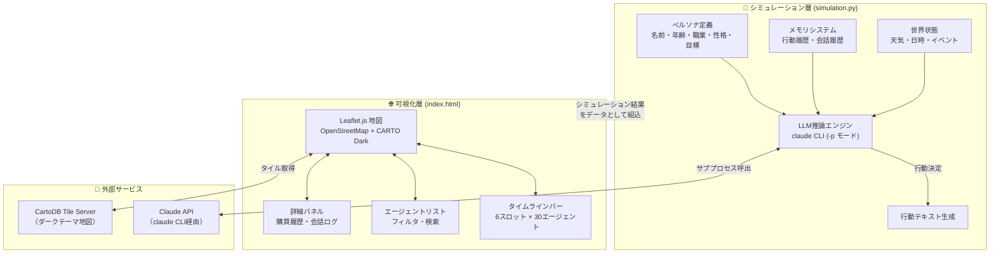
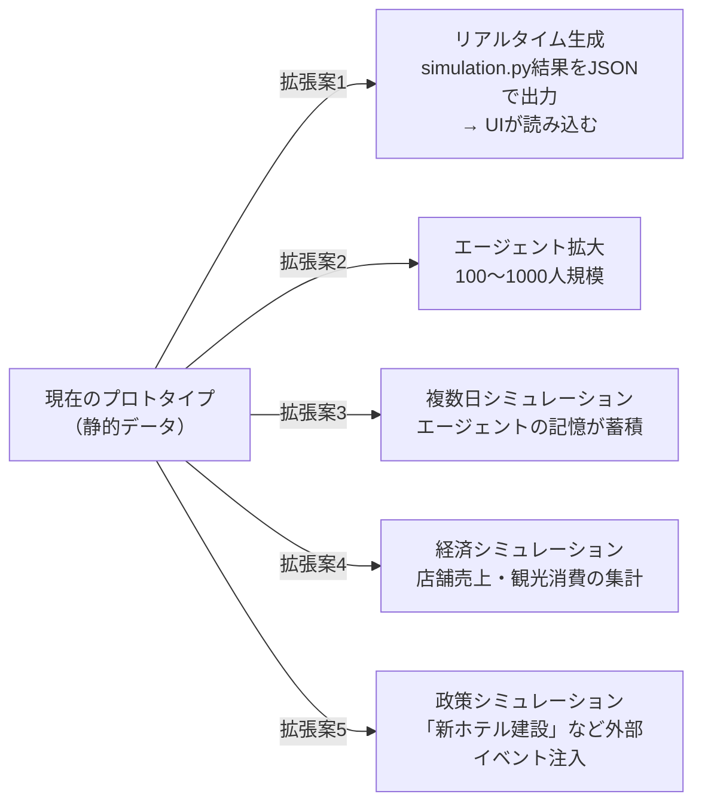

# 🏝️ 石垣島 社会シミュレーション

> **AgentSociety** にインスパイアされた、LLMエージェントによる石垣市内の社会・購買行動シミュレーション。
> 30人の多様なペルソナが石垣市内を移動し、買い物・食事・会話を通じて1日を過ごす様子を、インタラクティブな地図UIで可視化します。

---

## 📋 目次

1. [プロジェクト概要](#プロジェクト概要)
2. [システムアーキテクチャ](#システムアーキテクチャ)
3. [シミュレーションの原理](#シミュレーションの原理)
4. [エージェント設計](#エージェント設計)
5. [UIの詳細説明](#uiの詳細説明)
6. [クイックスタート](#クイックスタート)
7. [ディレクトリ構成](#ディレクトリ構成)
8. [利用上の留意点](#利用上の留意点)
9. [利用したデータソース](#利用したデータソース)
10. [今後の拡張アイデア](#今後の拡張アイデア)

---

## プロジェクト概要

本プロジェクトは、AIエージェントが **ペルソナ（人格）** を持ち、ある1日を通じてリアルな行動・消費・対話を行う **ソーシャルシミュレーション** のプロトタイプです。

### 何ができるか

| 機能 | 内容 |
|------|------|
| 🗺️ **地図上での可視化** | 石垣市内の実在スポット上に30人のエージェントをリアルタイム表示 |
| ⏰ **タイムライン追跡** | 早朝〜夜の6時間帯における各エージェントの行動を追跡 |
| 💰 **購買行動の記録** | 各エージェントが何をどこで買ったかを時系列で記録・集計 |
| 💬 **エージェント間会話** | 特定の時間・場所で出会ったエージェント同士の会話シーンを再現 |
| 🔍 **フィルタリング** | 地元民・移住者・観光客の3カテゴリで絞り込み表示 |

### インスピレーション元

- **[AgentSociety](https://github.com/tsinghua-fib-lab/AgentSociety)** — 清華大学FIB-Labによるマルチエージェント都市シミュレーションフレームワーク
- **[Generative Agents (Stanford)](https://arxiv.org/abs/2304.03442)** — LLMによる生成エージェントの社会的行動研究

---

## システムアーキテクチャ



### 技術スタック

```
simulation.py          index.html
─────────────         ──────────────────────────────
Python 3.14           HTML5 / CSS3 / Vanilla JS
anthropic SDK ──→     Leaflet.js 1.9.4
claude CLI            CartoDB Dark Tile
subprocess            (外部ライブラリなし)
dataclasses
```

---

## シミュレーションの原理

### 1. エージェントの意思決定フロー

各エージェントは「ペルソナ情報 + 記憶 + 世界状態」を入力として、Claude APIに問い合わせることで行動を自律的に決定します。

```
┌──────────────────────────────────────────────────────────┐
│                   行動決定サイクル（1スロット）            │
│                                                          │
│  ┌─────────────┐   ┌──────────────┐   ┌─────────────┐   │
│  │  ペルソナ情報 │   │  記憶システム  │   │  世界状態    │   │
│  │ ・名前・年齢  │   │ ・過去の行動  │   │ ・天気・日時  │   │
│  │ ・職業・性格  │   │ ・会話履歴    │   │ ・島イベント  │   │
│  │ ・目標・現在地│   │ （直近5件）   │   │ ・時間帯     │   │
│  └──────┬──────┘   └──────┬───────┘   └──────┬──────┘   │
│         │                 │                  │           │
│         └─────────────────┼──────────────────┘           │
│                           ▼                              │
│              ┌────────────────────────┐                  │
│              │      プロンプト生成      │                  │
│              │  「あなたは石垣島にいる   │                  │
│              │   一人の人間です...」    │                  │
│              └──────────┬─────────────┘                  │
│                         │  subprocess.run()              │
│                         ▼                                │
│              ┌────────────────────────┐                  │
│              │   claude -p "prompt"   │                  │
│              │   （認証不要・CLI利用）  │                  │
│              └──────────┬─────────────┘                  │
│                         │                                │
│                         ▼                                │
│              ┌────────────────────────┐                  │
│              │  行動テキスト（1〜3文）  │                  │
│              │  → メモリに蓄積         │                  │
│              └────────────────────────┘                  │
└──────────────────────────────────────────────────────────┘
```

### 2. エージェント間インタラクション

2人のエージェントが同じ場所・同じ時間帯に出会う場合、両者のペルソナを渡して会話を生成します。

```
Agent A ──┐
          ├──→ Claude: 「2人のペルソナ + 状況説明 → 会話を生成」
Agent B ──┘
               ↓
          会話テキスト（各2〜3セリフ）
               ↓
          両エージェントの記憶に追加
```

**実装されているインタラクション（シナリオ3件）:**

| 時間帯 | 場所 | エージェントA | エージェントB | きっかけ |
|--------|------|-------------|-------------|---------|
| 昼 12-14時 | 市場食堂 | 田中健一（漁師） | 鈴木美咲（観光客） | 隣席でグルクンについて質問 |
| 夕方 17-19時 | ゲストハウス | 鈴木美咲（観光客） | 山田拓海（移住者） | 宿の看板を見て立ち寄る |
| 夜 19-21時 | 居酒屋ひとし | 田中健一（漁師） | 山田拓海（移住者） | 居酒屋で偶然同席 |

### 3. Claude CLIを使ったAPIキー不要の実行

本プロジェクトの特徴は、`ANTHROPIC_API_KEY` の手動設定が不要な点です。

```python
result = subprocess.run(
    ["claude", "-p", prompt],   # Claude Codeのセッションを再利用
    capture_output=True,
    text=True,
    timeout=120,
)
```

`claude -p` はClaude Code CLIのプリントモードで、既存の認証セッションをそのまま利用します。

---

## エージェント設計

### ペルソナの3分類

```
                     石垣島の人々
                         │
        ┌────────────────┼────────────────┐
        │                │                │
   🟢 地元民           🟣 移住者         🟠 観光客
   （12人）            （6人）           （12人）
        │                │                │
  漁師・農家・         ゲストハウス      一人旅・家族・
  公務員・教師         カフェ・農業      バックパッカー
  看護師・店主         エンジニア        ビジネス旅行
        │                │                │
  消費パターン:       消費パターン:    消費パターン:
  日常的・低額        地元×観光ミックス  観光的・高額
  食材・日用品        食材仕入れ等      お土産・体験
```

### 各エージェントのデータ構造

```javascript
{
  id: 'tanaka',          // 一意ID
  name: '田中健一',       // 名前
  age: 52,               // 年齢
  emoji: '🎣',           // アイコン
  type: 'local',         // 分類 (local/migrant/tourist)
  job: '漁師',            // 職業

  schedule: [            // 6スロット × 行動データ
    {
      loc: 'port',                    // 現在地キー
      title: '早朝漁・グルクン豊漁',    // 短タイトル（15〜25文字）
      action: '夜明け前から沖に...',   // 詳細テキスト（2〜3文）
      buys: [                         // 購買データ
        { e: '🍵', n: 'さんぴん茶', p: 130, s: '自販機' }
        //  emoji   品名              価格   店名
      ]
    },
    // ... 6スロット分
  ]
}
```

### 購買行動の分布（設計値）

```
地元民の1日消費額目安: ¥500〜¥4,000  （日常的消費）
移住者の1日消費額目安: ¥800〜¥8,000  （仕入れ含む場合あり）
観光客の1日消費額目安: ¥2,000〜¥50,000（お土産・体験等）
```

---

## UIの詳細説明

### 画面レイアウト

```
┌────────────────────────────────────────────────────────────────────┐
│ 🏝️ 石垣島 社会シミュレーション  2026年3月23日  [🏠12][🌱6][✈️12]  ☀️25℃ │  ← ヘッダー
├──────────────┬─────────────────────────────────────┬───────────────┤
│              │                                     │               │
│  フィルタータブ│                                     │  詳細パネル    │
│ [全員][地元民] │           Leaflet.js 地図             │  （エージェント│
│ [移住者][観光客│                                     │   選択時表示） │
│              │  🎣 🏠 📸 🤿 🎒...                  │               │
│  エージェント  │      30人のマーカー                  │  ┌──────────┐ │
│  リスト       │  (カテゴリ色で分類)                   │  │縦タイムライン│ │
│              │                                     │  │🌅 早朝...  │ │
│ 🎣田中健一 52 │  ── 選択エージェントの移動軌跡 ──      │  │☀️ 午前...  │ │
│  漁師         │  ・・・・・・●──●──●──●            │  │🌞 昼 ▼    │ │
│ 早朝漁・グルクン│                                     │  │  行動詳細  │ │
│ 📍石垣漁港    │  ──── インタラクションライン ────      │  │  購買履歴  │ │
│ 💰¥2,650     │  🟠─ ─ ─ ─🟠 (会話発生時)            │  │💰¥2,650   │ │
│              │                                     │  └──────────┘ │
│ ...          │                                     │               │
│ (スクロール)  │                                     │               │
├──────────────┴─────────────────────────────────────┴───────────────┤
│  ⏰ タイムライン                                    [🌞 昼 12-14時]   │
│                                                                    │
│    🌅●──────────●──────────●──────────●──────────●──────────●🌙    │  ← タイムラインバー
│   早朝        午前         昼 💬      午後       夕方 💬     夜 💬   │
│   6-8時      9-12時      12-14時    14-17時    17-19時    19-21時   │
└────────────────────────────────────────────────────────────────────┘
```

### 各コンポーネントの説明

#### 1. ヘッダー
| 要素 | 説明 |
|------|------|
| タイトル | プロジェクト名・日付 |
| 分類バッジ | 地元民/移住者/観光客の人数を常時表示 |
| 天気バッジ | シミュレーション日の天候 |

#### 2. エージェントリスト（左サイドバー）
| 要素 | 説明 |
|------|------|
| フィルタータブ | 全員・地元民・移住者・観光客で絞り込み |
| 検索ボックス | 名前・職業でインクリメンタル検索 |
| エージェントカード | 現在の行動タイトル・場所・累計消費額を表示 |
| 🛒マーク | 現在のスロットで購買が発生している場合に表示 |

#### 3. 地図（中央メイン）
| 要素 | 説明 |
|------|------|
| ベースマップ | CartoDB Dark（ダークテーマ）+ OpenStreetMap |
| 場所ラベル | 21箇所の施設名を常時表示 |
| エージェントマーカー | カテゴリ色（🟢🟣🟠）のドット、同一場所では円形に分散配置 |
| 移動軌跡 | 選択エージェントのそのスロットまでの経路を点線表示 |
| 会話ライン | インタラクション発生スロットで2者間に橙色の点線 |
| ポップアップ | マーカークリックで名前・場所・タイトル・購買情報を表示 |

#### 4. タイムラインバー（下部）
```
ドット ──── ドット ──── ドット ──── ...
  ↑ 接続線（--before疑似要素）   💬 = インタラクション発生スロット
  クリックで時間帯切り替え
  現在スロットは青くグロー
```

#### 5. 詳細パネル（右、エージェント選択時表示）

```
┌──────────────────────────────┐
│ 🎣 田中健一（52歳）            │
│    漁師  [地元民]              │
├──────────────────────────────┤
│ 今日の累計消費（昼まで）        │
│ 1日合計: ¥2,650  → ¥480      │  ← 現在スロットまでの実績
├──────────────────────────────┤
│ 縦タイムライン（アコーディオン）  │
│ ─────────────────────────── │
│ 🌅 早朝 6-8時  📍石垣漁港      │
│   早朝漁・グルクン豊漁          │
│ ─────────────────────────── │
│ ☀️ 午前 9-12時 📍公設市場  ▼   │  ← 展開中スロット
│  ┌──────────────────────┐    │
│  │ 競りが終わって...詳細文  │    │
│  │ 🍵 さんぴん茶 ¥130 自販機│   │
│  └──────────────────────┘    │
│ 🌞 昼 12-14時 💬 ¥350         │  ← 💬=会話あり
│ ...                           │
└──────────────────────────────┘
```

---

## クイックスタート

### 前提条件

- Claude Code CLI がインストール・ログイン済みであること
- Python 3.11以上
- 現代的なWebブラウザ（Chrome / Firefox / Safari）

### 1. シミュレーション実行（オプション）

シミュレーション結果はすでにUIに組み込まれていますが、再生成したい場合:

```bash
cd workspace/ishigaki-simulation

# anthropic SDK のインストール（初回のみ）
pip3 install anthropic --break-system-packages

# シミュレーション実行（30〜40分かかります）
python3 simulation.py
```

> ⚠️ `simulation.py` は30エージェント × 6スロット = 180回のClaude API呼び出しを行います。
> 実行時間は環境によって異なりますが、おおよそ30〜45分かかります。

### 2. UIの起動

```bash
cd workspace/ishigaki-simulation

# ローカルサーバー起動（ポート8888）
python3 -m http.server 8888

# ブラウザで開く
open http://localhost:8888/index.html
```

### 3. UIの操作方法

| 操作 | 説明 |
|------|------|
| タイムラインのドットをクリック | 時間帯を切り替え |
| エージェントカード（左）をクリック | エージェントを選択・詳細表示 |
| 地図のマーカーをクリック | 同じくエージェントを選択 |
| フィルタータブをクリック | カテゴリ絞り込み |
| 検索ボックスに入力 | リアルタイム検索 |
| 詳細パネルの各スロットをクリック | 行動詳細・購買履歴を展開 |
| 詳細パネルの ✕ をクリック | 詳細パネルを閉じる |
| 地図をピンチ/スクロール | 地図のズーム |

---

## ディレクトリ構成

```
workspace/ishigaki-simulation/
│
├── index.html          # メインUI（地図・タイムライン・詳細パネル）
│                       # 844行 / 全データ組み込み済み
│
├── simulation.py       # AIシミュレーション実行スクリプト
│                       # 266行 / claude CLI呼び出し
│
└── README.md           # 本ファイル
```

---

## 利用上の留意点

### ⚠️ データについて

| 項目 | 内容 |
|------|------|
| **フィクション** | エージェントのペルソナ・行動・会話はすべてAI生成のフィクションです。実在する個人とは無関係です |
| **店舗情報** | 店舗名・座標は実在する施設を参考にしていますが、正確性を保証しません。実際の営業時間・存在確認は各自でお願いします |
| **座標精度** | 緯度・経度は文献調査に基づく概算値です。実測値と最大200〜300m程度の誤差がある場合があります |
| **購買金額** | 金額はシミュレーション上の参考値であり、実際の相場と異なる場合があります |

### ⚠️ 技術的な制約

| 項目 | 内容 |
|------|------|
| **再現性なし** | `simulation.py` を再実行するたびに異なる行動テキストが生成されます |
| **APIコスト** | `simulation.py` の実行は多数のClaude API呼び出しを消費します |
| **オフライン不可** | 地図タイルはCartoDB CDNから取得するため、インターネット接続が必要です |
| **モバイル未最適化** | UIはデスクトップ（1280px以上）を前提に設計されています |
| **タイムアウト** | 1回のClaude CLI呼び出しのタイムアウトは120秒に設定されています |

### ⚠️ 倫理的留意点

- 本シミュレーションは学術・研究・教育目的のプロトタイプです
- 生成されたコンテンツは石垣島や沖縄文化を断定・評価するものではありません
- 観光と地域社会の関係性に関する描写はAIによる創作であり、特定の立場を支持するものではありません

---

## 利用したデータソース

### 地図・座標データ

| データ | ソース | ライセンス |
|--------|--------|-----------|
| 地図タイル | [CartoDB Positron Dark](https://carto.com/basemaps/) | CC BY 3.0 |
| 地図データ | [OpenStreetMap](https://www.openstreetmap.org/) | ODbL 1.0 |
| Leaflet.js | [Leaflet 1.9.4](https://leafletjs.com/) | BSD 2-Clause |

### 施設座標の参考文献

| 施設 | 参考ソース |
|------|-----------|
| 石垣市公設市場 | [公設市場公式サイト](https://ishigaki-kousetsu-ichiba.com/) |
| ユーグレナ石垣港離島ターミナル | [石垣市公式](https://www.city.ishigaki.okinawa.jp/) |
| 島そば一番地 | [食べログ・公式サイト](https://www.shimasoba-yaeyama.jp/) |
| 居酒屋ひとし | [食べログ](https://tabelog.com/okinawa/A4705/A470501/47001373/) |
| マックスバリュ やいま店 | [イオン琉球公式](https://www.aeon-ryukyu.jp/store/maxvalu/yaima/) |
| ドラッグストアモリ 石垣店 | [公式サイト](https://www.doramori.co.jp/store/1514.html/) |
| 沖縄県立八重山病院 | [病院公式サイト](https://yaeyamaweb.hosp.pref.okinawa.jp/) |
| 石垣市役所 | [石垣市公式](https://www.city.ishigaki.okinawa.jp/) |
| 川平湾 | [Wikipedia](https://ja.wikipedia.org/wiki/%E5%B7%9D%E5%B9%B3%E6%B9%BE) |

> **座標の確認方法:** 全施設の座標は Google Maps / OpenStreetMap でそれぞれ確認することを推奨します。本プロジェクトでの座標は概算値です。

### AIモデル

| 用途 | モデル | 呼び出し方法 |
|------|--------|-------------|
| エージェント行動生成 | Claude Haiku 4.5 | `claude -p "prompt"` (CLI) |
| エージェント会話生成 | Claude Haiku 4.5 | `claude -p "prompt"` (CLI) |

> **Claude CLI認証について:** `simulation.py` はAPIキーを環境変数に設定する代わりに、インストール済みの Claude Code CLI (`claude -p`) を直接呼び出します。これにより、Claude Code が認証済みであれば追加設定なしで実行できます。

---

## シミュレーションの数値サマリー

```
┌─────────────────────────────────────────────────────────┐
│                  シミュレーション規模                      │
│                                                         │
│  👥 エージェント数:    30人                               │
│     🏠 地元民:         12人                              │
│     🌱 移住者:          6人                              │
│     ✈️ 観光客:         12人                              │
│                                                         │
│  ⏰ 時間スロット:       6スロット（早朝〜夜）              │
│  📋 スケジュールエントリ: 180件                           │
│  📍 登録ロケーション:   21箇所                           │
│  💬 インタラクション:    3シーン                          │
│  🛒 購買イベント総数:   約90件                           │
│                                                         │
│  💻 コード規模:                                          │
│     index.html:     844行                               │
│     simulation.py:  266行                               │
└─────────────────────────────────────────────────────────┘
```

---

## 今後の拡張アイデア

### シミュレーション強化



### UI強化

- **ヒートマップ表示**: 時間帯別の人口密度・購買密度の可視化
- **集計ダッシュボード**: 総消費額・人気スポット・会話ネットワーク図
- **アニメーション再生**: タイムラインの自動再生機能
- **シナリオ比較**: 異なる設定でのシミュレーション結果を並べて比較

---

## ライセンス

本プロジェクトは学習・研究目的のプロトタイプです。

- **地図データ**: OpenStreetMap © ODbL 1.0
- **地図タイル**: CARTO © CC BY 3.0
- **Leaflet.js**: BSD 2-Clause License
- **シミュレーションコード**: 自由に利用・改変可（帰属表示推奨）

---

*Built with [Claude Code](https://claude.ai/claude-code) · Inspired by [AgentSociety](https://github.com/tsinghua-fib-lab/AgentSociety)*
